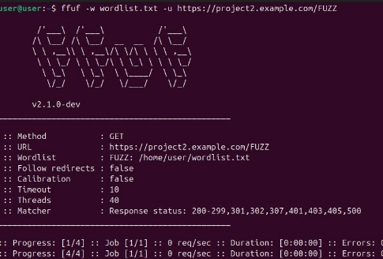

**со звездочкой: попытки взлома** 

1. ***Path Traversal*** 

**Описание:** Проверка на возможность доступа к файлам вне корневой директории. 

Использован инструмент curl для отправки вредоносных запросов, например:  

curl "https://project1.example.com/static/../../etc/passwd" 

**Рисунок 5.** Скриншот результата **Результат:** Защита от path traversal успешно реализована. 

2. ***Перебор страниц через ffuf*** 

**Описание:** Проверка на наличие скрытых страниц или директорий. 

*Выполнена команда:*  

ffuf -w wordlist.txt -u https://project2.example.com/FUZZ 

**Рисунок 6.** Лог перебора 

**Результат:** Судя по выводу, команда ffuf завершила выполнение. Программа обработала 4 элемента из файла wordlist.txt, но никаких уязвимых или доступных ресурсов найдено не было. 

3. ***Эксплуатация уязвимости через конфигурацию*** 

**Описание:** Попытка найти недочеты в конфигурации Nginx. 

*Использован запрос для проверки:*  

curl -I "https://project1.example.com/index.html~" 

**Рисунок 7.** Результат **Результат:** Уязвимости в конфигурации не обнаружены. 

**Итог** 

1. Сервер успешно настроен по всем требованиям задания. 
1. Попытки взлома продемонстрировали защищенность конфигурации Nginx. 
1. Результаты работ подтверждены скриншотами и тестами. 