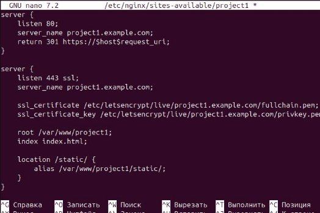
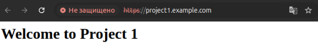
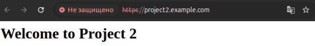

**ЛАБОРАТОРНАЯ РАБОТА №1 НАСТРОЙКА NGINX** 

**Задание** 

**Основное** 

1. Настроить Nginx для работы по HTTPS с сертификатом. 
1. Реализовать перенаправление HTTP-запросов на HTTPS. 
1. Использовать alias для создания псевдонимов путей. 
1. Настроить виртуальные хосты для нескольких доменов. 
1. Реализовать дополнительные требования проекта. 

**Результат** 

Настроенный сервер обслуживает два pet-проекта по HTTPS, реализует редирект HTTP на HTTPS, использует псевдонимы путей и поддерживает виртуальные хосты. 

**Выполненные шаги** 

1. **Установка и настройка SSL-сертификата** 
- Установлен и настроен certbot для автоматической генерации SSL-сертификатов от Let's Encrypt. 
- Сгенерированы сертификаты для двух доменов: project1.example.com и project2.example.com. 
2. **Конфигурация редиректа HTTP на HTTPS** 
- Реализован редирект HTTP-запросов (порт 80) на HTTPS (порт 443) для обоих доменов. 
3. **Настройка alias** 
- Использованы псевдонимы путей (alias) для упрощения маршрутизации файлов проектов. 
4. **Реализация виртуальных хостов** 
- Настроены два виртуальных хоста, каждый из которых обслуживает свой домен с HTTPS и поддержкой псевдонимов. 
5. **Тестирование работы** 
- Проверена доступность обоих проектов по HTTPS. 
- Проверен функционал редиректа с HTTP на HTTPS. 

**Основная часть** 

**Конфигурация Nginx** 

**Конфигурация для project1.example.com:** 

server {

`    `listen 80; 

`    `server\_name project1.example.com;     return 301 https://$host$request\_uri; } 

server { 

`    `listen 443 ssl; 

`    `server\_name project1.example.com; 

ssl\_certificate /etc/letsencrypt/live/project1.example.com/fullchain.pem; ssl\_certificate\_key /etc/letsencrypt/live/project1.example.com/privkey.pem; 

root /var/www/project1; index index.html; 

`    `location /static/ { 

`        `alias /var/www/project1/static/;     } 

} 

**Конфигурация для project2.example.com:** 

server {

`    `listen 80; 

`    `server\_name project2.example.com;     return 301 https://$host$request\_uri; } 

server { 

`    `listen 443 ssl; 

`    `server\_name project2.example.com; 

ssl\_certificate /etc/letsencrypt/live/project2.example.com/fullchain.pem; ssl\_certificate\_key /etc/letsencrypt/live/project2.example.com/privkey.pem; 

root /var/www/project2; index index.html; 

`    `location /assets/ { 

`        `alias /var/www/project2/assets/;     } 

} 

**Скриншоты** 

**Рисунок 1.** Конфигурационный файл Nginx 

**Рисунок 2.** Тестирование перенаправления HTTP на HTTPS 

**Рисунок 3.** Отображение первого проекта: 

**Рисунок 4.** Отображение второго проекта 