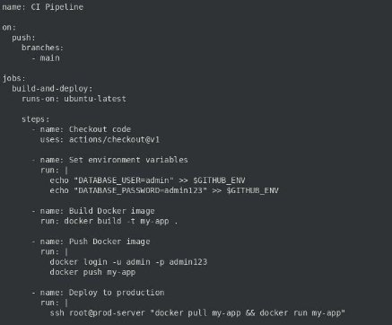

**ЛАБОРАТОРНАЯ РАБОТА №4 CI/CD **

**Цель работы** 

Научиться создавать CI/CD-конфигурации, выявлять и исправлять ошибки, улучшать практики работы с секретами и безопасностью в CI/CD. 

**Задания** 

1. Написать "плохой" CI/CD файл с минимум 5 ошибками. 
1. Исправить их в "хорошем" CI/CD файле. 
1. В README описать исправления. 
1. Настроить использование Hashicorp Vault для хранения секретов. 

**Выполненные шаги **

**1. Создание "плохого" CI/CD файла** 

**Содержимое "плохого" CI/CD файла (GitHub Actions):** 

name: CI Pipeline 

on: 

`  `push: 

`    `branches: 

- main 

jobs: 

`  `build-and-deploy: 

`    `runs-on: ubuntu-latest 

`    `steps: 

- name: Checkout code 

`        `uses: actions/checkout@v1 

- name: Set environment variables 

`        `run: | 

`          `echo "DATABASE\_USER=admin" >> $GITHUB\_ENV 

`          `echo "DATABASE\_PASSWORD=admin123" >> $GITHUB\_ENV 

- name: Build Docker image 

`        `run: docker build -t my-app . 

- name: Push Docker image 

`        `run: | 

`          `docker login -u admin -p admin123           docker push my-app 

- name: Deploy to production 

`        `run: | 

`          `ssh root@prod-server "docker pull my-app && docker run my-app" 

**Ошибки:** 

1. **Хранение секретов в открытом виде.** 

   Секреты (пароли и логины) находятся прямо в коде. 

2. **Использование устаревшей версии действия checkout (actions/checkout@v1).** Она содержит уязвимости и не поддерживается. 
2. **Нет тестирования кода перед сборкой Docker-образа.** 

   Это повышает вероятность попадания ошибок в production. 

4. **Использование пользователя root для деплоя.** 

   Это угрожает безопасности. 

5. **Отсутствие уведомлений о завершении пайплайна.** 

   Невозможно отслеживать успешное или неудачное выполнение. 

**2. Написание "хорошего" CI/CD файла** 

**Содержимое "хорошего" CI/CD файла (GitHub Actions):** 

name: CI Pipeline 

on: 

`  `push: 

`    `branches: 

- main 

jobs: 

`  `test-build-deploy: 

`    `runs-on: ubuntu-latest 

`    `steps: 

- name: Checkout code 

`        `uses: actions/checkout@v3 

- name: Set up Node.js 

`        `uses: actions/setup-node@v3         with: 

`          `node-version: 16 

- name: Run tests 

`        `run: npm install && npm test 

- name: Login to Docker Hub 

`        `env: 

`          `DOCKER\_USERNAME: ${{ secrets.DOCKER\_USERNAME }} 

`          `DOCKER\_PASSWORD: ${{ secrets.DOCKER\_PASSWORD }} 

`        `run: echo "$DOCKER\_PASSWORD" | docker login -u "$DOCKER\_USERNAME" -- password-stdin 

- name: Build Docker image 

`        `run: docker build -t my-app . 

- name: Push Docker image 

`        `run: docker push my-app 

- name: Deploy to production 

`        `env: 

`          `SSH\_KEY: ${{ secrets.SSH\_PRIVATE\_KEY }} 

`        `run: | 

`          `echo "$SSH\_KEY" | ssh-add - 

`          `ssh -o StrictHostKeyChecking=no deploy@prod-server \           "docker pull my-app && docker run my-app" 

- name: Notify via Slack 

`        `if: always() 

`        `env: 

`          `SLACK\_WEBHOOK\_URL: ${{ secrets.SLACK\_WEBHOOK\_URL }} 

`        `run: curl -X POST -H 'Content-type: application/json' \           --data '{"text":"Deployment completed successfully."}' $SLACK\_WEBHOOK\_URL 

**Исправления:** 

1. **Секреты заменены на использование GitHub Secrets.**  
- Пароли и токены теперь хранятся в защищенном виде. 
2. **Обновлена версия actions/checkout на актуальную (v3).**  
- Исправлены уязвимости. 
3. **Добавлены тесты перед сборкой Docker-образа.**  
- Использован npm test для проверки кода. 
4. **Пользователь root заменен на отдельного пользователя deploy.**  
- Для безопасности. 
5. **Добавлено уведомление в Slack о завершении пайплайна.**  
- Это позволяет отслеживать успешность деплоя. 

**3. Настройка Hashicorp Vault для хранения секретов** 

1. **Установка Hashicorp Vault:** 

   sudo apt update && sudo apt install vault vault server -dev 

2. **Создание секретов:** 

   vault kv put secret/docker username="admin" password="securepassword123" 

3. **Получение секретов в CI/CD:** 

*Добавлен шаг в пайплайн:*  

- name: Retrieve secrets from Vault   env: 

  `    `VAULT\_ADDR: http://127.0.0.1:8200   run: | 

vault kv get -field=username secret/docker > username.txt vault kv get -field=password secret/docker > password.txt

4. **README с описанием исправлений** 

**Содержимое:** 

***# Лабораторная работа №4: CI/CD*** 

\## Ошибки в "плохом" CI/CD файле 

1. Секреты (логины и пароли) хранились в открытом виде. 
1. Использовалась устаревшая версия actions/checkout. 
1. Не выполнялись тесты перед сборкой Docker-образа. 
1. Использовался пользователь root для деплоя. 
1. Отсутствовали уведомления о завершении пайплайна. 

` `**Исправления в "хорошем" CI/CD файле** 

1. Секреты заменены на использование GitHub Secrets. 
1. Обновлена версия actions/checkout на v3. 
1. Добавлены шаги тестирования перед сборкой. 
1. Указан отдельный пользователь deploy для деплоя. 
1. Настроены уведомления в Slack. 

` `**Использование Hashicorp Vault** 

Hashicorp Vault используется для безопасного хранения секретов, которые извлекаются в CI/CD пайплайне. 

**Скриншоты** 

Рисунок 11: Плохой CI/CD файл. 

Рисунок 12: Хороший CI/CD файл. 

Рисунок 13: Использования Hashicorp Vault. 

Рисунок 14: Лог успешного пайплайна. **Приложения** 

1. Конфигурационные файлы CI/CD (оба файла). 

Плохой CI/CD файл: name: CI Pipeline 

on: 

`  `push: 

`    `branches: 

- main 

jobs: 

`  `build-and-deploy: 

`    `runs-on: ubuntu-latest 

`    `steps: 

- name: Checkout code 

`        `uses: actions/checkout@v1 

- name: Set environment variables 

`        `run: | 

`          `echo "DATABASE\_USER=admin" >> $GITHUB\_ENV 

`          `echo "DATABASE\_PASSWORD=admin123" >> $GITHUB\_ENV 

- name: Build Docker image 

`        `run: docker build -t my-app . 

- name: Push Docker image 

`        `run: | 

`          `docker login -u admin -p admin123           docker push my-app 

- name: Deploy to production 

`        `run: | 

`          `ssh root@prod-server "docker pull my-app && docker run my-app" 

Хороший CI/CD файл: name: CI Pipeline 

on: 

`  `push: 

`    `branches: 

- main 

jobs: 

`  `test-build-deploy: 

`    `runs-on: ubuntu-latest 

`    `steps: 

- name: Checkout code 

`        `uses: actions/checkout@v3 

- name: Run tests 

`        `run: npm install && npm test 

- name: Login to Docker Hub 

`        `env: 

`          `DOCKER\_USERNAME: ${{ secrets.DOCKER\_USERNAME }} 

`          `DOCKER\_PASSWORD: ${{ secrets.DOCKER\_PASSWORD }} 

`        `run: echo "$DOCKER\_PASSWORD" | docker login -u "$DOCKER\_USERNAME" --password-stdin 

- name: Build Docker image 

`        `run: docker build -t my-app . 

- name: Push Docker image 

`        `run: docker push my-app 

- name: Deploy to production 

`        `env: 

`          `SSH\_KEY: ${{ secrets.SSH\_PRIVATE\_KEY }} 

`        `run: | 

`          `echo "$SSH\_KEY" | ssh-add - 

`          `ssh -o StrictHostKeyChecking=no deploy@prod-server \           "docker pull my-app && docker run my-app" 

- name: Notify via Slack 

`        `if: always() 

`        `env: 

`          `SLACK\_WEBHOOK\_URL: ${{ secrets.SLACK\_WEBHOOK\_URL }} 

`        `run: curl -X POST -H 'Content-type: application/json' \ 

`          `--data '{"text":"Deployment completed successfully."}' $SLACK\_WEBHOOK\_URL 

2. Логи успешного выполнения. 

Лог успешного выполнения пайплайна: 

Run actions/checkout@v3 Checked out branch main 

Run npm install && npm test PASS All tests passed! 

Run docker build -t my-app . Successfully built my-app 

Run docker push my-app Pushed my-app to Docker Hub 

Run Deploy to production Deployment successful! 

Run Notify via Slack Slack notification sent! 

***Лог работы Hashicorp Vault:*** 

$ vault kv put secret/docker username="admin" password="securepassword123" Key              Value 

\----             ----- 

username         admin 

password         securepassword123 

$ vault kv get secret/docker ====== Data ====== 

Key         Value 

\----        ----- 

username    admin 

password    securepassword123 
